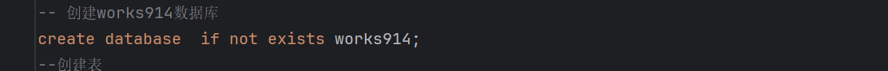
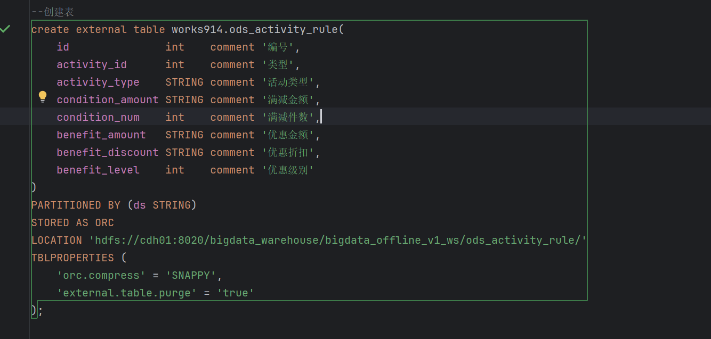

[//]: # (用于在Git版本控制系统中指定哪些文件或目录应该被忽略，不被提交到版本库中)
>

[//]: # (with base_t as 是一个公共表 简称CTE,CTE是一种临时的结果集，可以用于简化复杂的查询，使得查询更加清晰和易于维护)
with base_t as ()

[//]: # (创建works914数据库)
>
创建ods_activity_rule表
> 

